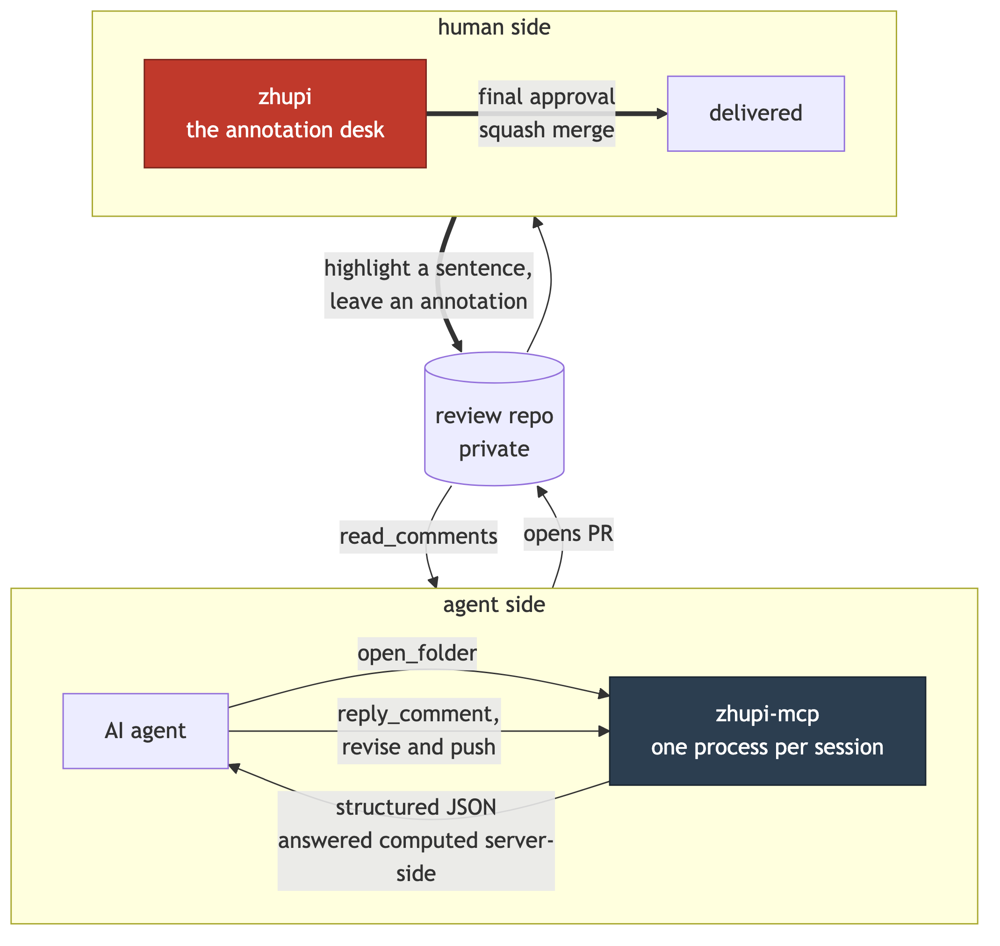

<div align="center">

**English** · [中文](README.zh-CN.md)

# zhupi-mcp

**The agent side of [zhupi](https://github.com/charliezong18/zhupi), as an MCP server.**<br>
zhupi is where a human reads and annotates AI-authored documents. This is the other end of that loop: the tools an agent uses to submit a document, read the annotations, and reply to each one.

[Spec](SPEC.md) · [Milestones](MILESTONES.md) · [Backlog](BACKLOG.md) · [zhupi (the app)](https://github.com/charliezong18/zhupi)

</div>

---

## Status: spec only

**No server code exists yet.** This repo currently contains documents and no implementation — no npm package, no `dist/`, nothing to install. If you came here for a working MCP server, come back after Phase 1.

One piece *has* shipped, and it is not part of the server: the [route guard](SPEC.md) that refuses raw `gh pr create` against the folder repo. It lives in the review-loop skill, not here, and it ships first on purpose — see "What MCP does not fix" below.

Where things stand: [MILESTONES](MILESTONES.md) has the per-phase exit criteria and what actually happened; [OPEN-QUESTIONS](OPEN-QUESTIONS.md) has what is still undecided and the default being proceeded on. What follows describes what is being built, in the present tense, because that is what a spec is for — not because it exists.

## Why

The agent side of this loop already works. It lives in a `~/.claude/skills/review-loop/` skill: one 8KB prose file plus four bash scripts. It got hardened on 2026-07-28 after measuring what actually leaked — 3 of 8 submissions missed a required marker, 11 documents shipped without their translation pair. The conclusion was that prose reminders do not cure missed execution, only gates do, so the rules moved into scripts.

That fixed the rules. It did not fix three other things:

| | The pain |
|---|---|
| **Cross-harness** | A Claude Code skill only exists inside Claude Code. Every other agent runtime — Antigravity, Codex, the desktop app — cannot submit a document at all |
| **Context cost of reading back** | "Read the annotations" is a string of `gh api` calls plus the model parsing threads and inline positions by hand, every single time. Structured JSON collapses that to one call |
| **Untyped inputs** | Required fields live in prose. A missing one surfaces when a shell script dies halfway, not when the call is made |

## What MCP does *not* fix

Worth saying plainly, because it is the obvious thing to assume: **an MCP server does not stop an agent from bypassing it.** The model can still shell out to `gh pr create` and skip every gate. Moving the logic from bash to TypeScript changes the implementation, not the routing.

What blocks the route is a `PreToolUse` hook that refuses raw `gh pr create` against the review repo. That is ten lines of config, it is independent of this repo, and it ships first ([SPEC §7](SPEC.md)).

This distinction is the reason the spec exists. If you are considering the same move, decide which of the two problems you actually have.

## Tool surface

Six tools. Merging is deliberately not one of them — that is the human's click, in the app.

| Tool | What it does |
|---|---|
| `open_folder` | Submit a document: branch, commit, push, open the PR, weld in the backlink marker, verify it landed |
| `lint_folder` | Check house style before submitting |
| `audit_folders` | Sweep everything already open for gaps |
| `list_folders` | List submissions, with unanswered-annotation counts |
| `read_comments` | Read annotations back as structured JSON, with `answered` computed server-side |
| `reply_comment` | Reply to one annotation, or post an overall comment |

## How it works



The repo in the middle is the whole interface. Neither side calls the other; both talk to GitHub. That is why zhupi can be taken off at any time, and why this server can be swapped for a bash script without the human noticing.

Node + TypeScript, stdio transport, installed by absolute path — no global npm state. GitHub auth is borrowed from `gh auth token` rather than managing a second PAT.

## Known limits

Honest list, in advance:

- **The concurrency fix is a file lock, not a queue.** A stdio MCP server is one process per session, not a shared daemon, so it cannot serialize across sessions on its own. `flock` plus a throwaway worktree does the job; the mechanism is worth knowing before you assume otherwise.
- **The session-backlink marker is best-effort.** It is detected by walking the process tree, which works only when the caller is a descendant of the host CLI. When it cannot be detected, nothing is embedded — a silently wrong id is worse than a missing button.
- **The lint rewrite is where the risk is.** The existing bash checks have accumulated fixes that a rewrite can silently drop. [SPEC §5](SPEC.md) documents each rule's *actual* behaviour (which drifts from its documentation in three places) and requires a differential test against the old scripts before shipping.
- **Personal-scale by design.** One reviewer, one review repo, no multi-tenant story.

## Fork it

The repo name and local checkout path are configuration, not constants:

```
ZHUPI_REVIEW_REPO=<owner>/<repo>     default: charliezong18/review
ZHUPI_REVIEW_PATH=<path>             default: ~/Developer/review
```

The conventions the tools enforce — bilingual pairs, cross-link headers, the five-section PR body — are one person's house style. Fork and change them; they are rules in one module, not assumptions spread through the code.

## License

[MIT](LICENSE) © Charlie Zong
