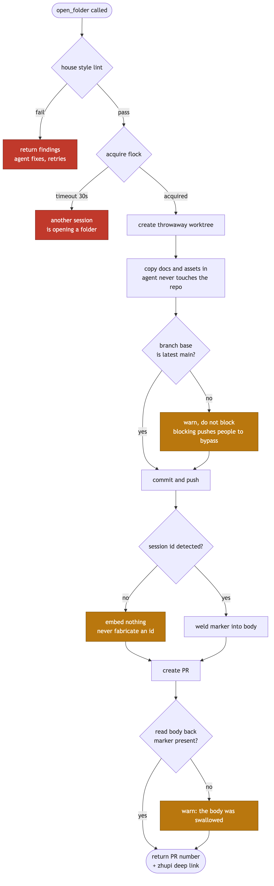
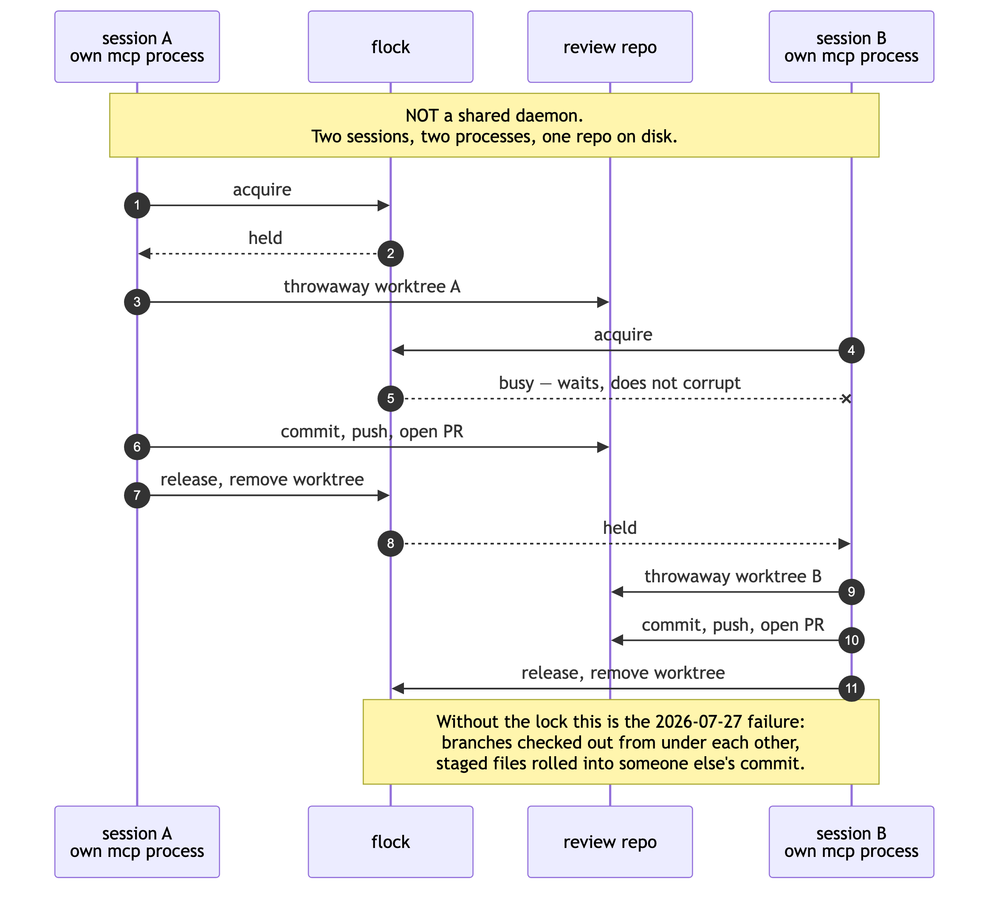
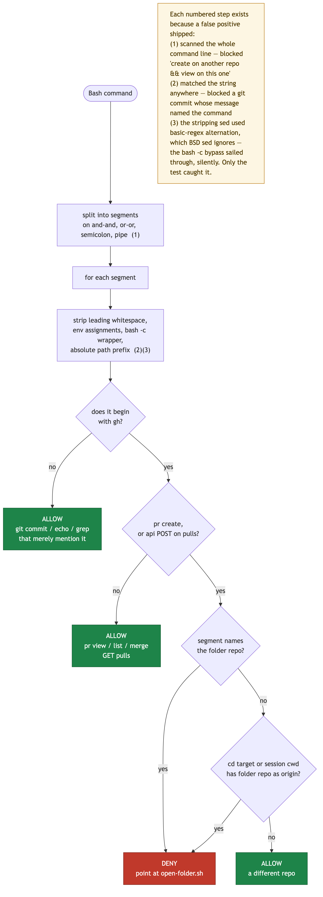

**English** · [中文](SPEC.zh-CN.md)

# zhupi-mcp — The agent-side MCP server for the annotation desk (zhupi)

Final Design · 2026-07-28

Companion product: [`charliezong18/menxia`](https://github.com/charliezong18/menxia) (the annotation desk (zhupi), human side). This repo is the agent side.

---

## 1. Why we are doing this

The agent side of the zhupi loop currently lives in `~/.claude/skills/review-loop/`: an 8KB SKILL.md plus four bash scripts. Hardened recently on 2026-07-28 — shifting house style from prose reminders to script gates. The trigger was measured data: "3 out of 8 folders missed return-to-session markers, 11 lacked bilingual pairs". The conclusion: **documentation reminders do not cure execution leaks**.

This iteration solves the two things left unsolved from that time.

**MCP does not solve "bypassing".** After welding gates into scripts, the remaining vulnerability is a routing issue — the model can skip that path and directly run `gh pr create`. Switching to MCP can be bypassed just the same. What truly blocks the route is the PreToolUse hook, see §7. These two things must be done and accounted for separately; MCP should not be treated as a means to prevent bypassing.

**MCP solves three other things:**

| Benefit | Current pain |
|---|---|
| **Save context reading comments** | "Reading comments" is currently a string of `gh api` calls plus the model manually parsing threads and inline position, burning significant context window every time. Returning structured JSON drives this cost to near zero. **This is a cost paid on every turn, making it the #1 reason.** |
| **Prevent parallel trampling** | Tripped on this on 2026-07-27 — multiple sessions touching `~/Developer/review` concurrently, switching away each other's branches and rolling unstaged files into someone else's commit. The current countermeasure is a line in CLAUDE.md saying "use separate worktrees when parallel", which is yet another prose reminder. See §4.2, the mechanism is file locks, not single-process. |
| **Typed inputs** | 5-part body, slug, and bilingual pairs can be strictly required via schema. Missing parameters are bounced back for retry by the MCP layer on the spot, rather than failing halfway through a script. Real, but minor benefit. |

**Cross-harness was previously ranked first, downgraded to speculative benefit on 2026-07-29.** The original argument was "skills only live in Claude Code, agy/CCD/Codex cannot submit a folder", while heavy lifting is increasingly outsourced to agy. Charlie decided in review to drop agy, focus solely on Claude for now, and Codex "maybe next, no rush" — **thus this benefit has zero consumers today**. It didn't become false, it just shifted from "immediate payoff" to "might pay off someday", so it no longer bears the weight of the argument. The three points above are enough to support this project; if the day comes where only this point remains, we must re-evaluate.

---

## 2. Scope

**In scope**: `open_folder` (submit a folder), `lint_folder` (lint before submitting), `audit_folders` (audit existing), `list_folders` (list folders), `read_comments` (read comments), `reply_comment` (reply).

**Out of scope**:

- **sealed (squash-merged) will not be a tool.** That is an action Charlie clicks on the annotation desk (zhupi); the agent side has no reason to hold this capability.
- **Post-delivery ledger entry will not be a tool** (tracker numbers, STATUS.md in-flight tables) — those are scattered across different vault locations, belong to the skill's prose responsibilities, and are unfit to be hardcoded into schemas.
- **No changes to the zhupi frontend.** This repo couples with `charliezong18/menxia` solely via GitHub (PR body conventions, `<!-- happy-session: -->` marker format); they do not share code.

---

## 3. Tool Surface

Universal convention: All tool error returns must be **actionable by the model** — e.g., "`docs/foo.md` is missing the Chinese pair `docs/foo.zh-CN.md`", so the model can read it, fix it itself, and retry. No stack traces are returned.

### 3.1 `open_folder` — submit a folder

```
title:      string              Folder title
body: {
  destination: string          Destination (vault / issue in a repo / email …)
  directLink:  string?         Direct link
  tldr:        string          TLDR
  decisions:   string          For you to decide
  howto:       string          How to use
}
docs:       string[]           Local absolute paths, both of the bilingual pair must be provided
assets:     string[]?          Local absolute paths, images referenced in the text
sessionId:  string?            For override; if absent, the server auto-detects, if it can't detect it won't embed
monolingual: boolean?          This folder is a monolingual reading, exempt from the bilingual pair; registered in docs/.monolingual
track: {                       Folder tracking (review #61, approved 2026-07-31). Omitting it only warns — but don't let new folders go in bare
  proj: string | string[]      Project slug(s), lowercase alnum-dash; check existing proj: labels before coining a new word
  kind: enum                   拍板 / 评审 / 设计 / 读物 / 交付 / 参考 — primary purpose, pick one
  wait: enum?                  你拍 / 你读 / agent / 闲; derived when absent: has decisions → 你拍, 读物 → 闲, else 你读
  needs: int[]?                Folders whose conclusions this one depends on
  supersedes: int[]?           Folders this one covers/replaces — deal with them when this folder is merged (the #58 zombie lesson)
  unblocks: string?            One phrase: what merging releases (≤120 chars, no semicolons/newlines/-->)
}
```

Returns: PR number, PR URL, deep link to the annotation desk (zhupi) `https://charliezong18.github.io/menxia/?pr=<n>`, lint report.

**`track` (added 2026-07-31, review #61)**: applies three label families (`proj:` / `kind:` / `wait:`, vocabulary constants live **only** in `src/track.ts` — the rename lesson: cross-system contracts are bare strings, hard-code both ends and they fail silently; the reader recognizes prefixes only) and welds a trailing relation marker `<!-- menxia-rel: needs=…; supersedes=…; unblocks=… -->` into the PR body, same family as `happy-session`. Label application is two-step: best-effort create missing labels with the vocabulary colors, then one `POST …/issues/{n}/labels` (which auto-creates any stragglers in default gray — verified against the real repo 2026-07-31). Label failures are warnings, never errors — the folder is already up; conflating the two makes callers re-submit.

**`docs` passes paths, not full text**, this is deliberate. Running on the same machine, the server copies files into the worktree it manages; the agent never touches `~/Developer/review` — parallel trampling is exactly what blocks execution. Passing full text via tool arguments not only wastes tokens, but also keeps the agent in the mental model of "I can write into that repo myself".

Copy destination: `docs` land in `docs/<basename>`; `assets` land in `docs/assets/…` — if `/assets/` appears in the source path, **preserve the entire segment after it**, otherwise use the basename. Referenced in the text via relative paths starting with `assets/`.

**`monolingual: true` (added 2026-07-31)**: **appends** this folder's document paths to `docs/.monolingual` on the folder's own branch (append, never overwrite — entries inherited from main must not be lost; losing one means those folders get hard-failed by Rule 1 on their next pass, and nobody notices immediately). It rides into main with the folder, and folders cut from main afterwards inherit it. Same model as `.payload`.

Why it was added: D9 introduced this exemption, but **it had never once been usable** — it is a file inside the repo, while `open_folder` only copies `docs` to `docs/<basename>`, so no path could create or append to it. The third (cross-system) review recorded this as "the registry files are unreachable" and it was filed as theoretical; in practice #31 (the 22-chapter 官制史) spent its whole life reporting 22 false hard findings — and **a check that starts reporting false red is a check people learn to ignore**.

(2026-07-30 amendment: The previous version said to unconditionally flatten to `docs/assets/<basename>`. The actual layout in the repo has subdirectories — `docs/assets/shots/annotate.png`, etc., and `docs/zhupi-readme.md` references exactly `assets/shots/setup.png`. zhupi resolves relative to the document's own directory (`render.js:27`); flattening would turn these references into broken images, and Rule 4 would blame the document, making people modify the text — meaning the same document would say different things in two folders.)



The three orange spots in the diagram are **deliberately non-blocking**: lagging branch bases only warn (blocking pushes people to bypass the gate), failing to detect the session id means don't embed it (never invent one), and failing to read back the body still returns (the PR is already created, hiding it is worse). The two red spots are the real aborts.

### 3.2 `lint_folder` — lint before submit a folder

```
docs:    string[]     Local absolute paths
assets:  string[]?
```

Returns: structured findings[], each containing `severity: error | warn`, `rule`, `message`, `file`. See §5.1 for the rule list.

**One fewer rule can be checked.** The existing `folder-lint.sh` runs inside the folder repo worktree, getting the folder's documents via `git diff origin/main...HEAD`, thus enabling "branch base" checks. `lint_folder` receives paths scattered locally, outside any relevant git tree, so it only runs rules 1-4 (bilingual pairs / reciprocal headers / `.payload` exceptions / broken images). **"Branch base" only runs inside `open_folder`** — by then the server has its own worktree, and the git context is complete. This difference must be explicitly declared in the `lint_folder` return, otherwise it provides a false sense of security that the "house style is compliant".

### 3.3 `audit_folders` — existing folder audit

```
(No parameters)
```

Returns: the house style gaps of each folder + return-to-session markers + draft status, plus per-folder `trackNotes` — the four tracking checks (review #61): ① zombie candidates (a merged folder declared `supersedes` over a still-open one), ② dependencies unlocked (`needs` targets now merged), ③ `wait:` drift (labeled "waiting on him" while needsReply > 0 — actually waiting on an agent), ④ merge-ready candidates (he engaged — provable `fromDesk` only, anything else over-reports under the shared account — and every comment is handled). `trackNotes` is separate from `problems`: "dependency unlocked" is good news, not a defect. Counts come from the same `readAll` path the listing tools use — never a second implementation (design §2). If the extra material (closed list, counts) can't be fetched, the four checks degrade to a note and the rest of the audit still runs. **Strictly read-only** — disposal (close / merge / relabel) always waits for Charlie.

**~~`fix`~~ — upon implementation on 2026-07-30, neither of the two things could be done, so this parameter was removed.**

- **Backfilling return-to-session markers**: Can only backfill the **current** session's id, which is not the session that submitted this folder — meaning inventing one. This directly contradicts [§4.4](#44-probing-the-return-to-session-marker) "if you can't detect it, don't embed it, never invent one; silent misdirection is worse than nothing", and the consequence is the button sends Charlie into an irrelevant session. The old script `audit-folders.sh:38` backfilled exactly like this.
- **Promoting draft to ready**: GitHub REST's `PATCH /pulls/{n}` **does not accept the `draft` field**, leaving GraphQL's `markPullRequestReadyForReview` as the only option; but putting `POST /graphql` into the write allowlist equates to opening up all mutations (deleting repos and merging folders all go through that single endpoint), rendering the allowlist meaningless on the spot. Changed to printing `gh pr ready <n>` for humans to run themselves.

Corollary: `PATCH /pulls/{n}` has no users left and is removed from the write allowlist — this server could only send two types of write requests: create folder, reply. (2026-07-31: folder tracking #61 added the two label routes — create label, apply labels — bringing the total to **four**. Still no PATCH/PUT/DELETE: removing/renaming labels is a disposal action, and disposal belongs to Charlie.)

Marker checks examine the **value**, not the prefix: `<!-- happy-session: -->` and incorrectly formatted ids both fail to render the button on the zhupi side (`link.js:88`); checking only the prefix equals reporting a false green. The `grep -q 'happy-session:'` in the old script `audit-folders.sh:32` has exactly this flaw.

### 3.4 `list_folders` — list folders / "has he annotated it?"

```
state: "open" | "merged"    default open
```

Returns: Folder number, title, branch, **unanswered comment count**.

### 3.5 `read_comments` — read comments

```
pr: number?    omitted = scan all open folders
```

Returns:

```
folders: [{
  number, title, headRefName,
  inline: [{ id, path, line, quote, body, inReplyToId, answered: boolean }],
  conversation: [{ id, body, author, answered: boolean }],
  unansweredCount: number
}]
```

**`answered` is calculated by the server, not returning the raw list for the model to judge itself.** "An inline comment with no reply from our side = unprocessed" is currently re-deduced by the model every time, which is the easiest step to leak. Charlie listing opinions in the conversation area (without highlighting lines) also counts as annotations, so `conversation` similarly carries `answered`.

### 3.6 `reply_comment` — reply

```
pr:        number
commentId: number     Root inline comment id. **Required**
body:      string
```

Uses `POST /pulls/{n}/comments/{id}/replies`, appending to the comment thread instead of opening a new one. The `**回话**` prefix on the first line is welded on by the tool (hard convention ③), the caller does not need to write it themselves; if the first line is a block-level construct (fenced block / list / heading…), the prefix starts a new paragraph — zhupi passes the entire reply body through markdown-it (`cards.js:48`), being on the same line would read a code block as an inline code span.

**~~Omitting `commentId` means sending a conversation comment~~ — this was deprecated on 2026-07-30 (during Phase 3 implementation).** Hard convention ① (`guard-reply-body.sh`) established at 10:54 that day forbids the agent from sending conversation comments to the conversation area: conversation comments sent by the agent look exactly the same as Charlie's in the API (shared account), turning into fake to-dos in `list_folders` that cannot be cleared — measured 7 out of 13 `needsReply` were the agent's own words, overreporting by 77%. The guard is newer than this section and has empirical data; follow the guard. Folder-level summaries **are spoken in the chat**, and metadata intended to be archived is written into the `docs/<slug>.md` body.

At the tool surface, **the capability to send a conversation comment does not exist at all** (not just discouraged via descriptions): `POST /issues/{n}/comments` is simply not in `WRITE_ALLOWED`.

Two additional items added in Phase 3 — **the three PreToolUse hooks are only attached to Claude Code's Bash tools, MCP calls bypass them**, so those gates must be reimplemented on this side; otherwise, the net effect of Phase 3 is "moving submit a folder to a new path with no gates":

- **Sealed (squash-merged)/closed folders are outright rejected** (the `guard-closed-folder` rule). 2026-07-29 #23 empirical data: the agent replied as usual when the folder was already merged, all commands succeeded but the result was zero.
- **If `commentId` is a reply, automatically swap it for its root**. It is unknown if GitHub normalizes this, and in case it doesn't, zhupi would treat it as an orphan and start a new card with no quote (`anchor.js:165`).

---

## 4. Architecture

Node 20 + TypeScript, `@modelcontextprotocol/sdk`, stdio transport.

### 4.1 Installation

Write absolute paths in the MCP config:

```json
{ "command": "node", "args": ["/Users/charliezong/Developer/menxia-mcp/dist/index.js"] }
```

**Do not use `npm link`.** Tripped on this on 2026-07-24 — global single pointer hijacked, causing a production rollback and half a day of cleanup. Operations resembling a global single pointer are strictly barred from this project.

The folder repo (default `charliezong18/review`) and local checkout path (default `~/Developer/review`) go through environment variables `ZHUPI_REVIEW_REPO` / `ZHUPI_REVIEW_PATH`, no hardcoding — this repo is public.

### 4.2 Concurrency: File locks, not single-process

**Correcting an assumption first: stdio-based MCP servers launch a separate process per session, they are not shared daemons**, so they inherently cannot queue across sessions. Preventing parallel trampling relies on:

- Locking `~/Developer/review` (lock file placed outside the repo: `~/.zhupi-mcp/review.lock`)
- Every `open_folder` opens a temporary worktree inside the lock, cleaning it up when done
- Lock wait timeouts return readable errors, letting the caller know another session is submitting a folder, rather than hanging dead

`worktree.ts` is the **only** module that touches `~/Developer/review`.

**~~`flock`~~ — discovered missing on this machine during implementation on 2026-07-30.** The original text in this section specified `O_EXLOCK | O_NONBLOCK`. Empirical test shows Node v25.2.1's `fs.constants` **does not have `O_EXLOCK`** (`O_*` only has RDONLY / WRONLY / RDWR / CREAT / EXCL / NOCTTY / TRUNC / APPEND / DIRECTORY / NOFOLLOW / SYNC / DSYNC / SYMLINK / NONBLOCK), and macOS also lacks `flock(1)` to shell out to. Writing it as specified yields `O_CREAT | O_RDWR | undefined | O_NONBLOCK` — `undefined` acts as 0 in bitwise OR, **the lock flag silently disappears, resulting in a lock that never locks, and yet all tests remain green**.

Current approach: Atomically create a lock file using `O_EXCL`, storing `{pid, at}` inside. If any of the three liveness checks holds true, it is considered stale and grabable (contents unreadable / pid dead / older than the stale threshold — **derived from the git-timeout budget, not a hardcoded 5 minutes**: `staleMs()` = 3× the per-git-call timeout + 60s margin, floored at 600s, computed at check time so raising `ZHUPI_GIT_TIMEOUT_MS` widens it too; a legal hold spans fetch → commit → push and can reach ~540s, which the old 300s undershot). **Preventing deadlocks after a crash relies on the liveness check, not the kernel releasing the lock** — this distinction dictates there must be a real `SIGKILL` test on a lock-holding child process, instead of asserting "it should be obtainable".

Grabbing stale locks uses rename-aside, and all three spots must exist as a set (missing one allows two processes into the critical section simultaneously; all three were deduced during review, each paired with a seam test):

| Defense | What happens if omitted |
|---|---|
| Read back after acquiring the lock to confirm the pid is mine | Someone moved it away between lock creation and read-back; I proceed holding a non-existent lock |
| After moving it aside, verify the one grabbed is the one judged stale | B judges stale and is scheduled away → A grabs it and enters → B wakes up and moves aside A's **valid** lock, both are inside simultaneously |
| Before releasing, confirm the lock is still mine | I hold the lock for over 5 minutes (a slow push) and it is grabbed by B; upon finishing, I run a single `rmSync` and delete B's valid lock |

Subprocesses running git **must have a timeout** (180 seconds, overridable via env): on a real machine, `commit.gpgsign=true` will wait for a pinentry popup, and hooks in the repo might wait for input; lacking a timeout means the server hangs forever **while still holding the lock**, dragging other sessions down with it.



### 4.3 GitHub Integration

Octokit, token fetched on the fly from `gh auth token`, without managing a separate PAT — `gh` is already authenticated on the machine, an extra PAT is just an extra source of expiration. On 401, refetch once and retry.

(The zhupi frontend uses a fine-grained PAT because it runs in the browser where `gh` is unavailable. The two sides do not share credentials, nor should they.)

### 4.4 Probing the "return-to-session" Marker

The principle of `happy-session-id.sh` is climbing up the ppid chain from its own process, colliding every level's pid against the hostPid recorded for each session in `~/.happy/sessions.json`.

In stdio mode, the MCP server is a child process of Claude Code, so this chain **coincidentally remains valid**. But it is brittle:

- Callers other than Claude Code have no happy sessions at all, and will never detect anything
- `sessions.json` only accumulates and never cleans up (measured 114 entries all marked running); stale hostPids have long been recycled by the OS to other processes, colliding with them yields the **wrong** session id

The original script's handling of this is: verify upon hit that "this pid is currently indeed running happy". This must be preserved exactly.

**Strategy: If you can't detect it, don't embed it, never invent one.** The button simply won't appear; silent misdirection is worse than nothing. The `sessionId` parameter is retained for external callers to pass explicitly.

**The weight of this entire section was downgraded on 2026-07-29.** Charlie's qualitative verdict: "If you can return, return; if you can't, possessing this document means you can discuss it in any agent" — **the real backstop is self-contained documents, not this button**. Therefore, ppid detection failing in the future is not considered an incident, nor is it worth adding any compensation mechanisms for it (see OPEN-QUESTIONS).

### 4.5 Module Slicing

| Module | Responsibility | Dependencies |
|---|---|---|
| `lint.ts` | House style check, **pure function**: consumes file list + git info, spits out findings[]. Zero IO | None |
| `worktree.ts` | flock + temp worktree lifecycle. The only place touching the review repo | fs, child_process(git) |
| `body.ts` | 5-part body assembly, marker welding, read-back **self-verification** | github.ts |
| `session.ts` | ppid climbing, returns null if undetected | fs, child_process(ps) |
| `github.ts` | Octokit wrapper | @octokit/rest |
| `index.ts` | Tool registration and input validation, no business logic | All |

`lint.ts` having zero IO is deliberate — it contains the most rules and requires the most intensive unit testing; blocking IO out is the only way it becomes testable.

---

## 5. Porting Acceptance Criterion

The #1 risk during zhupi's own vanilla JS → Preact migration was "fixed things silently getting lost", so three rounds of item-by-item survival verification were conducted. The same applies to this rewrite.

### 5.1 Port based on implementation, not based on documentation

Having read the implementations of `folder-lint.sh` and `open-folder.sh`, **three document-to-implementation drifts have already been confirmed** — this is direct evidence for this rule. Porting must use the "Implementation Truth" in the table below as the standard, see also §5.3 Decided matters.

| # | Rule | SKILL.md claims | Implementation Truth |
|---|---|---|---|
| 1 | Bilingual pairs | "**Judge the original language first, then set the direction** — external drafts are inherently English, getting it backward wastes the translation" | **Only checks that both files exist**, does not check content language. Getting the direction wrong is not blocked at all |
| 2 | Reciprocal headers | English version first line `**English** · [中文](<slug>.zh-CN.md)`; Chinese version first line `[English](<slug>.md) · **中文**` | Consistent, character-by-character match (`grep -qxF` / anchored regex) |
| 3 | **`.payload` exceptions** | **This rule is missing from the document** | The "payload text" registered in `docs/.payload` (or `.payload`) is exempt from the English reciprocal header (adding it would paste that line into the external issue as well); but its Chinese version **must** contain the "Do not copy from this page" banner, missing it throws an error |
| 4 | Move images together | `assets/**` referenced in the text must actually exist in the repo | Consistent, but only matches markdown link syntax references, **HTML `` is unchecked**; and **does not skip fenced code blocks and inline code**, see below |
| 5 | Branch base | "Warn + list documents already on main" | Consistent, deliberately non-blocking (blocking pushes people to bypass the gate, a lesson from the pre-push incident) |
| 6 | 5-part PR body | "**Block on missing items**" | **Only `echo ⚠` to stderr, proceeds regardless**. The comment on line 27 of the script also says "Block on missing items", contradicting the code on line 29 |
| 7 | No drafts | `audit-folders.sh --fix` promotes to ready | Consistent |

Three additional implementation issues, to be preserved or explicitly changed during porting:

- **Broken image checks do not skip fenced code blocks and inline code — stepped on this personally with this folder.** The first time this spec was submitted, it was blocked by the lint, reporting two "broken images", which were actually string literal examples used in the text to illustrate the rules themselves (written inside inline code). A document explaining lint rules cannot pass the lint because the lint does not recognize code spans. **The TS version must strip fenced code blocks and inline code before scanning image references** — this uses the exact same stripping logic as the language detection in §5.3 #1, they should share a helper. The workaround at the time was rewriting the prose to avoid literals, which was a stopgap.
- `git fetch -q origin ... || true`: **Silently continues** upon network failure, at which point `origin/main` is stale, and the base check derives conclusions based on old data. The TS version should at least report "fetch failed, conclusions might be outdated" as a warn.
- The 5-part check uses `grep -q "$sec"`, meaning **if the section name appears anywhere in the body** it counts as passing, not requiring it to be a heading. The TS version should match against headings.

### 5.2 Differential test

Take all existing open folders plus a batch of deliberately malformed samples (at least one guaranteed failure case per rule), **run the old script and the new TS once each, and align the output item by item**.

Any difference has only two outcomes: if it's a bug, fix it; if it's a deliberate improvement, document it here and explain why. There are currently two known deliberate improvements: **#1 adding language direction ratio detection** (§5.3), and **#4 image references simultaneously checking HTML ``**. **Do not ship if they don't align.**

An incidental free benefit: pitfalls like macOS bash 3.2 lacking `mapfile` and associative arrays simply don't exist in TS (the top of `folder-lint.sh` specifically commented on this). But this also means **the logic structure cannot be copied verbatim** — those workaround patterns in the bash version where `while read` subshell variables aren't passed back (lines 74-77 writing FAIL to a temp file then grep'ing it back) are pure noise in TS. The logic must be reorganized during the rewrite, making differential testing all the more essential as a safety net.

### 5.3 Decided (Settled by Charlie on 2026-07-28)

- **#1 Language direction: Check by ratio.** First strip fenced code blocks and inline code, then calculate the CJK character ratio of the remaining text — English versions >30% throw an error, Chinese versions <30% throw an error (which incidentally catches missing translations). Choosing ratios over "throw an error upon encountering paragraphs of Chinese" is because glossaries, proper nouns, and mixed CJK-English lines won't breach the threshold, largely dodging false positives; whereas flipping the entire piece backwards is guaranteed to be caught. **This is a tightening compared to the existing script**, and belongs under "deliberate improvements" in the differential test, see §5.2.

- **#6 Missing 5-part items: Warn, do not block.** Meaning the code is correct, **it's the documentation that's wrong** — both line 5 of the SKILL.md house style table and the comment on line 27 of `open-folder.sh` wrote it as "block". Rationale: body paragraphs are meant for humans to read, missing them won't directly break zhupi's functionality like bilingual pairs do; and blocking too strictly pushes people to bypass the gate (the lesson from the pre-push incident). **This is not part of the porting work, but an outstanding documentation correction debt**, to be paid off together in §8 Phase 4.

---

## 6. Testing

- **`lint.ts` unit tests (vitest)**: At least one passing case + one guaranteed failure case for every rule in §5.1. This is the only module with mandatory coverage.
- **Differential test**: §5.2, kept in the repo as a one-time launch gate, re-runnable.
- **`body.ts` self-verification path**: `gh` has a track record of silently swallowing the body (lines 42-45 in `open-folder.sh` specifically wrote read-back verification for this), requiring a test case that mocks "creation succeeded but the body was lost".
- **`session.ts`**: Must return null rather than that id when a stale hostPid collides with another process.
- Not pursuing high coverage for `github.ts` / `worktree.ts` — they are thin and IO-heavy, and stand on the three pieces above plus a real-machine dry run.

---

## 7. Hook (Phase 0, **shipped on 2026-07-28**)

`~/.claude/skills/review-loop/guard-pr-create.sh`, attached to `PreToolUse(Bash)` in the global settings.json. Rejects on hit:

- `gh pr create` aimed at the folder repo
- `gh api -X POST .../pulls` ditto

Two acceptance criteria: **① The command segment explicitly names the folder repo; ② It doesn't name it, but the directory `cd`'ed into (or the session cwd) has the folder repo as its origin** — the second rule blocks the most likely bypass "`cd <worktree> && gh pr create`". Read operations (`pr view` / `pr list` / GET pulls) and other repos are entirely unblocked.

The rejection message points to the correct entry point at the time — currently pointing to `open-folder.sh`, and post-Phase 4 points to the MCP tool.

**Stepped into false positives three consecutive times during the rollout, each with the exact same root cause — mistaking "appearing in the string" for "this command is going to be executed". Recording all of them here, because rewriting this logic in the MCP version will step into them all over again:**

1. **Judge by command segment, not the whole string.** The first version scanned the entire command string; `gh pr create -R other repo && gh pr view -R folder repo` was mistakenly blocked — the two keywords belonged to different segments. Changed to slicing by `&& || ; |` and judging segment by segment.
2. **The start of the segment must truly be a gh call.** The second version blocked the guard author's own `git commit` — the commit message contained that command name, and the cwd happened to be in the folder repo worktree, hitting both acceptance criteria. Now it strips leading whitespace, env assignments, `bash -c` wrappers, and absolute path prefixes, then demands the remaining part **starts with `gh`**. `git commit -m "...gh pr create..."`, `echo`, `grep` are all let through.
3. **The wrapper-stripping sed must use `-E`.** BSD sed (native to macOS) basic regex does not support `\|` alternation, meaning writing that rule equated to complete failure — the `bash -c '...'` wrapper bypass had a clear path, and it was **silent**, discoverable only via testing. The top of `folder-lint.sh` specifically warned about the same class of pitfalls, yet we stepped into it again.

The accompanying `guard-pr-create.test.sh` has 21 test cases (10 should block / 11 should not); run it before touching the guard.



The steps labeled (1)(2)(3) in the diagram were each forced into existence by a real false positive — **not a single node in this tree was designed; they were all crashed into.**

This is independent of MCP, ship first and see results first. It is the "more permanent" correct answer; MCP is changing the carrier, not preventing bypasses.

---

## 8. Rollout Sequence

| Phase | Content | Why this sequence |
|---|---|---|
| **0** ✅ | Hook welds the route shut (shipped on 2026-07-28, see §7) | Independent of MCP, immediate payoff |
| **1** | Server skeleton + `list_folders` + `read_comments` + `mark_handled` | The first two are **read-only**; `mark_handled` only writes to local state files and doesn't touch the remote, so it can be `undo`'d. The context-saving benefit is cashed in immediately |
| **2** | `lint_folder` + §5.2 differential test alignment | Validation logic must stand firm first before trusting it with writes |
| **3** | `open_folder` + `audit_folders` + `reply_comment` | Write side, includes flock/worktree/marker self-verification |
| **4** | Scripts retire; SKILL.md slims down to "glossary + pointer to tools"; hook repoints to MCP; **pay off that §5.3 #6 documentation debt** ("missing 5-part items block" in SKILL.md house style line 5 and the `open-folder.sh` line 27 comment is false, change to "warn") | Wrap up |

Run a real-machine test at the end of each phase (genuinely submit a folder / genuinely read comments once), do not rely on unit tests to assert "it works".

---

## 9. Risks

| Risk | Handling |
|---|---|
| Rewrite loses existing fixes | §5.1 item-by-item implementation list + §5.2 differential test |
| Cross-harness has zero consumers today | Known and accepted (§1). The project stands on the other three benefits; if the day comes where only this point remains, re-evaluate |
| ppid detection fails in future Happy versions | If you can't detect it, don't embed it (existing strategy), failure manifests as a disappearing button, won't misdirect |
| Public repo leaks private information | This repo contains no document content; `charliezong18/review` repo name is configurable, default is written in README instead of hardcoded |


### 5.4 Deliberate improvement ledger (completed on 2026-07-30, post-Phase 2 three-round review)

§5.2 says "if it's a deliberate improvement, document it and explain why". During implementation, three items were missed from the ledger, all heading in the **dangerous direction** of "the old blocked, the new lets through" (caught in the second review round):

| Difference | Old | New | Why |
|---|---|---|---|
| First line has BOM | Blocks | Lets through | JS `trim()` consumes U+FEFF per specification |
| First line CRLF | Blocks | Lets through | Ditto, `trim()` consumes `\r` |
| First line trailing spaces | Blocks | Lets through | Ditto |

These three items **don't matter anymore** — round three of reading zhupi source code revealed the founding rationale for the reciprocal header rule was false (`lang.js` only pairs by filename and never reads the first line); the acceptance criterion has been changed to "the link target points to the correct file after resolution", and syntactic differences are uniformly downgraded to warnings.

**The three rules changed in round three (all misaligned with actual zhupi behavior):**

1. **Rule 2 changed from "character-by-character" to "can click to the other side", hard errors downgraded to warnings** (the syntactic difference part).
   Empirical data showed it was blocking #12, whereas #12 rendered perfectly normal on the annotation desk (zhupi).
2. **Rule 4 image references changed to resolve relative to the document's own directory**, consistent with `zhupi/src/render.js:26`.
   The previous version unconditionally concatenated against `docs/` — images for subdirectory documents would **be reported present by lint, but display as broken in zhupi**, skewing towards false negatives.
3. **Rule 1 adds `docs/.monolingual` to register exemptions.** After fixing the old script's false-pass bug, Rule 1 truly took effect for the first time, leading #31 (22 chapters of Chinese bureaucratic history) to be slapped with 22 hard errors — and no one is going to translate that into English.

**Rule 5 empirical data** (all 27 bilingual pairs): False positive rate **0/27**, but discriminative power is also near 0 —
The median requires 40% missing translation to alarm, 6 pieces missing 95% don't even report, and structurally it cannot see monolingual documents (25 out of 29 monolingual slugs are "Chinese lying in the English slot"). The threshold doesn't need to change (0 false positives, running as a warn has no cost), but **don't document it as "insurance for language direction"** — currently it can only catch "the entire piece wasn't translated a single word".

### 5.5 Phase 3 deliberate improvement ledger (2026-07-30)

The write side equally applies §5.1 "Port based on implementation". Every item below is where **the new implementation behaves differently from the old script**, clearly explaining why for each one, lest they get "fixed" back as bugs in the future.

| # | Old script | New implementation | Why |
|---|---|---|---|
| 1 | lint runs after the branch has been pushed | **lint is wedged after commit, before push** | `snapshot.ts` reads committed content, without commit there's nothing to test; stopping before push keeps the remote completely clean upon failure. The old script couldn't do this — when it ran, the branch had long been pushed manually |
| 2 | `audit-folders.sh --fix` backfills return-to-session markers | **Does not backfill** | Can only backfill the current session's id, which is inventing one (§3.3, §4.4) |
| 3 | `--fix` promotes draft to ready | **Only reports, provides command** | REST does not support it, only GraphQL; opening `POST /graphql` equates to opening all mutations |
| 4 | `guard-reply-body.sh` handles missing `**回话**` prefix by **rejecting** | **Weld shut** (auto-fill) | "Even if documented it can still be skipped, so weld it into the action itself" (the same rationale as §3.1). The tradeoff is that block-level constructs must be caught — if the first line is a fenced block / list, the prefix starts a new paragraph |
| 5 | Images unconditionally land in `docs/assets/<basename>` | If `/assets/` is in the source path, **preserve the entire segment after it** | The actual layout in the repo is `docs/assets/shots/*.png`, flattening makes existing document references into broken images, and Rule 4 would blame the document |
| 6 | Auditing `grep -q 'happy-session:'` | Checks the **value** of the marker | When the prefix is there but the value is non-compliant, zhupi cannot render the button; checking only the prefix reports a false green |
| 7 | "Pick another slug" whenever the branch already exists | **Local existence / remote existence are addressed separately** | "Locally exists, remotely does not" has only one origin: previously crashed before push, at which point the remote is completely clean; the correct action is clearing and starting over, not bypassing |
| 8 | `open-folder.sh` writes to `PARITY.md` ledger | **Does not write** | The new tool doesn't run the old bash lint, there is nothing to reconcile — D1's "10 consecutive times" counter froze as a result. **The criterion was replaced the same evening** (Charlie's call): every one of the nine rules must have a must-fail sample that the new implementation actually catches. Run `npm run retire-gate`; all nine were mutation-checked one by one and every one turned red. See [PARITY.md](PARITY.md) |
| 9 | `SKIP_LINT=1` unconditional gate shutdown escape hatch | **None** | Undecided. This project remembers its own lesson that "blocking too strictly pushes people to bypass the gate", so lacking this opening is a known debt, not a design |
| 10 | Retirement criterion = 10 consecutive submissions with zero disagreement (D1) | **One must-fail sample per rule** (`scripts/retire-gate.mjs`) | All three legs of the old criterion broke the same day: the samples had no discriminating power (88% of folders have zero hard findings on both sides) / the side treated as authoritative was itself broken (`folder-lint.sh:58` false pass) / the counter froze once submission moved into MCP. The new criterion measures that the new implementation really blocks, and turns red the moment a rule is deleted or downgraded |

**8 is settled** (criterion replaced the same evening — see row 10). **9 is still owed** — the escape hatch question is undecided.
**One more owed item that is not in this table: repo-side CI** (BACKLOG ⑤: the submission gate guards against slips, not against bypass; 6 bypass routes were measured, and the only real closure is pushing the criterion down to main — but that needs Charlie's say-so first).
